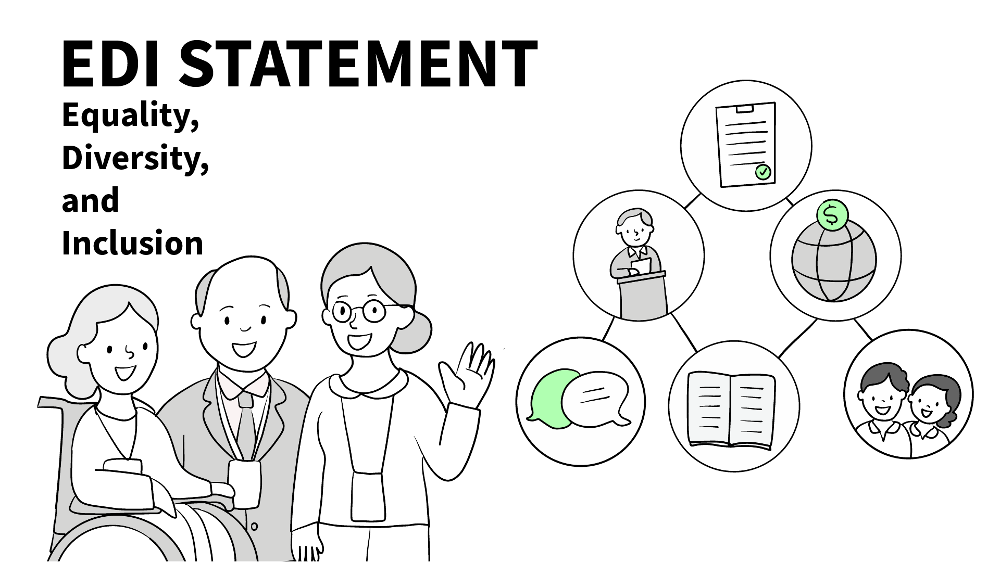

# Equality, Diversity, and Inclusion (EDI) Statement – SEMANTiCS 

  

At **SEMANTiCS**, we are committed to fostering an inclusive, diverse, and fair environment that welcomes participants from all backgrounds. Our goal is to ensure that every attendee, speaker, sponsor, and organizer feels respected, valued, and empowered to contribute fully to the conference experience.

 
## Our Commitments:
* **Inclusive Programming and Leadership:**
 We actively prioritize diversity and inclusion in the formation of the **Organizing Committee, Program Committee (PC)**, and other leadership roles. We aim to ensure a balanced representation in terms of gender, geographic origin, career stage, and disciplinary background.

* **Support for Emerging Researchers:**
 Each year, with the support of partner organizations, we **fund travel grants** for **young and early-career researchers** from underrepresented or financially constrained regions, enabling broader participation in the SEMANTiCS community.

* **Accessible and Inclusive Spaces:**
 We are dedicated to making the conference accessible for all attendees. This includes physical accessibility, inclusive materials, and accommodating specific needs whenever possible.

* **Safe and Respectful Environment:**
 A clear [Code of Conduct](https://2023-eu.semantics.cc/page/coc) guides interactions at the conference, with procedures in place for confidentially reporting and addressing harassment or discrimination.

* **Continuous Reflection and Growth:**
 We actively seek community feedback to improve our EDI practices and ensure that SEMANTiCS continues to evolve in alignment with these values.

* **Open Science Policy:**
To fully support its DEI activities, SEMANTiCS is dedicated to an **open science policy** founded on three pillars: (i) open access, (ii) open reviews, and (iii) open formats. This policy is constantly updated and adjusted to latest developments, ensuring international alignment and professional standards.

By embedding these principles into the foundation of SEMANTiCS,in each edition  we aim not only to advance research in semantic technologies but also to cultivate a conference culture that champions fairness, inclusion, and meaningful participation.
