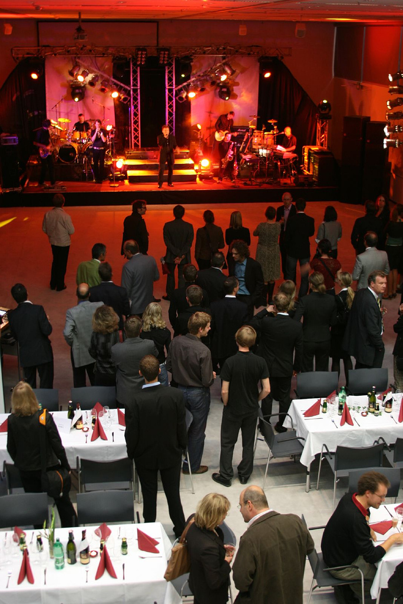
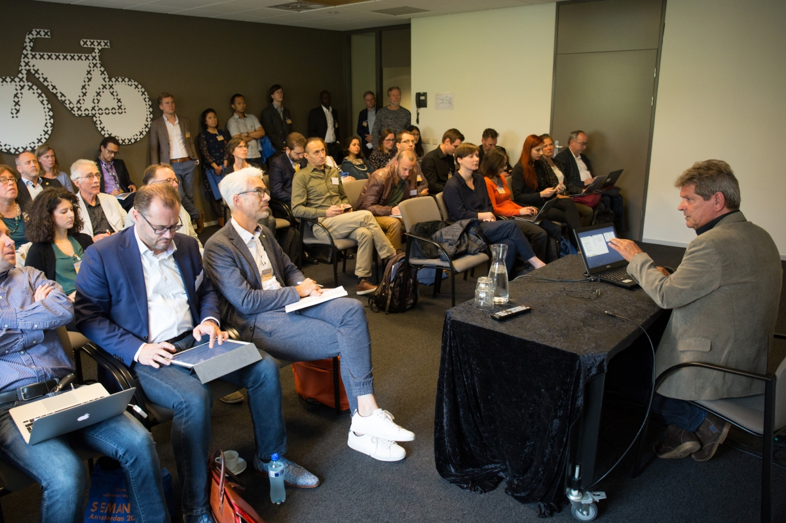
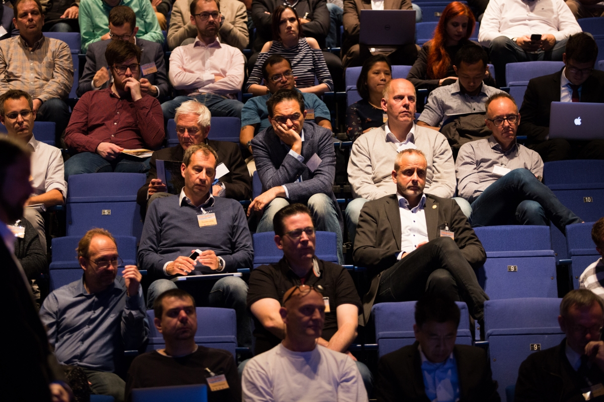
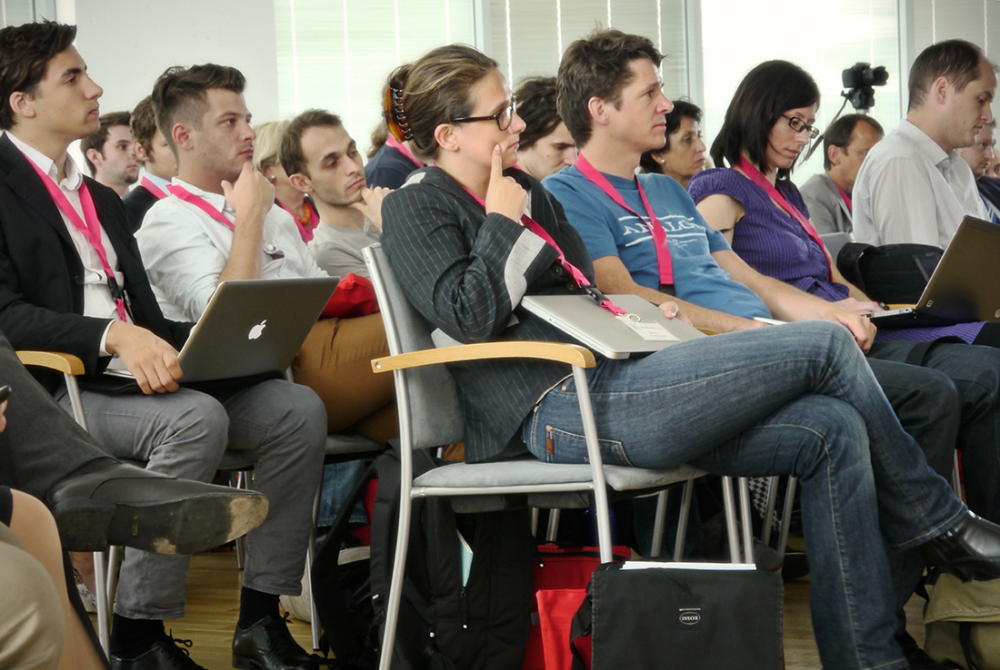

# Press Corner
##### SEMANTiCS is the leading European conference on semantic technologies that are at the core of data-driven applications. The 19th edition of SEMANTiCS brings international industry leaders, top researchers, data scientists, information management professionals and digital transformation experts together.  

If you are interested to cover the conference or conduct interviews with the speakers, please reach out to our PR team.
Approach us for media accreditation!

### Press pictures

<table>
<col class="col0">
<col class="col1">
<col class="col2">
<col class="col3">
<tbody>
    <tr>
      <td rowspan="2"></td>
      <td></td>
      <td></td>
      <td></td>
    </tr>
    <tr>
      <td></td>
      <td></td>
      <td></td>
    </tr>
    <tr>
      <td colspan="4" style="padding-top: 0px; text-align: left">Pictures free for reuse: CC by SEMANTICS</td>
    </tr>
</tbody>
</table>
 

### SEMANTiCS is featured in

<table id="featured_in">
<col class="col0">
<col class="col1">
<col class="col2">
<col class="col3">
<tbody>
    <tr>
      <td></td>
      <td></td>
      <td></td>
      <td></td>
      <td></td>
    </tr>
</tbody>
</table>

 

  

    <h3>Downloads</h3>
    
Official Logo

    
    <h3>Gallery</h3>
    
<ul><li><a href="https://www.flickr.com/photos/25094278@N02/albums">Flickr</a></li></ul>

    <h3>Videos</h3>
    
<ul>
        <li><a href="https://2017.semantics.cc/voices">Clips</a></li>
        <li><a href="https://youtu.be/VuMd0zWiack">Promotion Video</a></li>
        <!-- 2023 Video https://www.youtube.com/watch?v=yiSueDf84TI -->
        <li><a href="http://2015.semantics.cc/recordings">Keynote Recordings</a></li>
        <li><a href="http://2015.semantics.cc/voices">Participants Voices</a></li>
        <li><a href="https://vimeo.com/106100573">Promotion Video</a></li>
    </ul>

  

  

    <h3>Press Releases</h3>
    
<ul><li>September 5, 2019: 5 Tipps für eine bessere Wertschöpfung aus Daten (<a href="/sites/2019.semantics.cc/files/PM_Semantics_Karlsruhe.docx" target="_blank">DOCX</a>, <a href="/sites/2019.semantics.cc/files/PM_Semantics_Karlsruhe.pdf" target="_blank">PDF</a>)</li>
      <li>September 5, 2019: „Auf unsere Stärken besinnen“ - Experte Sören Auer zum KI-Standort Deutschland (<a href="/sites/2019.semantics.cc/files/PM_So%CC%88ren%20Auer.docx" target="_blank">DOCX</a>, <a href="/sites/2019.semantics.cc/files/PM_So%CC%88ren%20Auer.pdf" target="_blank">PDF</a>)</li>
      <li>July 9, 2019: Vier erfolgversprechende Beispiele für die Anwendung semantischer KI (<a href="/sites/2019.semantics.cc/files/PM_Anwendungsbeispiele_DE.pdf" target="_blank">Link</a>)</li>
      <li>July 9, 2019: 4 powerful examples for the Application of Semantic AI (<a href="/sites/2019.semantics.cc/files/PM_Anwendungsbeispiele_EN.pdf" target="_blank">Link</a>)</li>
      <li>April 12, 2019: SEMANTiCS 2019 brings together industry leaders and data scientists&nbsp;(<a href="/sites/2019.semantics.cc/files/PN_Semantics_en.pdf" target="_blank">Link</a>)</li>
      <li>April 12, 2019: SEMANTiCS 2019 führt Hightech und Wirtschaft zusammen&nbsp;(<a href="/sites/2019.semantics.cc/files/PN_Semantics_dt.pdf" target="_blank">Link</a>)</li>
      <li>June 29, 2018: Wer Chaos automatisiert, erhält automatisiertes Chaos. (<a href="http://fhstp.eyepinnews.com/lW63QvWcDgqZzA" target="_blank">Link</a>)</li>
      <li>May 9, 2018: Automate Chaos - and You'll Get Automated Chaos ( <a href="/sites/2018.semantics.cc/files/PM_Semantics_EN.pdf">PDF</a> English, <a href="/sites/2018.semantics.cc/files/PM_Semantics_EN.docx">DOCX</a> English, <a href="/sites/2018.semantics.cc/files/PM_Semantics2018_DE.pdf">PDF</a> German, <a href="/sites/2018.semantics.cc/files/PM_Semantics2018_DE.docx">DOCX</a> German)</li>
      <li>August 23, 2017: Amsterdam - this year’s hotspot on Linked Data Strategies &amp; Practices (<a href="/sites/2018.semantics.cc/files/Press%20Releas_SEMANTiCS-2017%20%281%29.pdf" target="_blank">PDF</a>, <a href="/sites/2018.semantics.cc/files/Press%20Releas_SEMANTiCS-2017.docx" target="_blank">DOCX</a>)&nbsp;</li>
      <li>May 23, 2016: Mit vernetzten Daten Informationskosten senken ...&nbsp;IBM, Springer Nature, Siemens und Technologieexperten aus aller Welt (<a href="/sites/2016.semantics.cc/files/Pressemitteilung_SEMANTiCS-2016_2016-05.pdf" target="_blank">PDF</a>)</li>
      <li>July 15, 2015: Wenn Maschinen Bedeutung verstehen ... Yahoo, NASA und internationale Technologie-Experten sprechen 
      über Status Quo und Zukunft semantischer Technologien (<a href="/sites/semantics.cc/files/Sponsors/PresseinfoDT2015.docx">DOCX</a>, <a href="/sites/semantics.cc/files/Sponsors/PresseinfoDT2015%20%281%29.pdf">PDF</a>)</li>
    </ul>

    <h3>Clippings</h3>
    
<strong>2019</strong>

    
<ul>
      <li>July 9, 2019, Computerwelt -&nbsp;<a href="https://computerwelt.at/news/semantics-2019-vier-beispiele-fuer-die-anwendung-semantischer-ki/" target="_blank">SEMANTiCS 2019: Vier Beispiele für die Anwendung semantischer KI</a></li>
    	<li>May 22, 2019:&nbsp;Data Science Blog&nbsp;-&nbsp;<a href="https://data-science-blog.com/blog/2019/05/22/interview-knowledge-graphs-and-semantic-technologies/">Knowledge Graphs and Semantic Technologies</a>&nbsp;</li>
    	<li>May 17, 2019:&nbsp;Big data Insider -&nbsp;<a href="https://www.bigdata-insider.de/semantics-2019-beleuchtet-ki-systeme-in-der-praxis-a-828698/">Semantics 2019 beleuchtet KI-Systeme in der Praxis</a></li>
    	<li>April 12, 2019:&nbsp;Tech Trends -&nbsp;<a href="https://techtrends.tech/tech-trends/what-is-your-ai-digitisation-strategy/" target="_blank">What is your AI Digitisation strategy?</a></li>
    	<li>April 5, 2019: Business Computing World -&nbsp;<a href="https://businesscomputingworld.co.uk/t/semantics-2019-brings-together-industry-leaders-and-data-scientists/2041" target="_blank">SEMANTiCS 2019 brings together industry leaders and data scientists</a></li>
    	<li>April 3, 2019:&nbsp;Businessportal  -&nbsp;&nbsp;<a href="https://www.businessportal24.com/de/semantics-2019-fuehrt-hightech-und-wirtschaft-zusammen.html" target="_blank">SEMANTiCS 2019 führt HiTech und Wissenschaft zusammen </a></li>
    </ul>

    
<strong>2018</strong>

    

      <ul><li>August 07, 2018: July Soft - 5 Experts on Business Digitization&nbsp;Strategies Based on Semantic AI (<a href="/sites/2018.semantics.cc/files/JULY.pdf" target="_blank">PDF</a>)</li>
  	<li>July 08, 2018: it&amp;t business - Megatrend Künstliche Intelligenz (<a href="/sites/2018.semantics.cc/files/itt-2018-07-08_web_19.pdf" target="_blank">PDF</a>)</li>
  	<li>June 22, 2018:&nbsp;&nbsp;Bigdata Insider -&nbsp;&nbsp;<a href="https://www.bigdata-insider.de/das-internet-hat-sein-limit-erreicht-weil-es-an-semantik-mangelt-a-716664">Internet hat sein Limit erreicht, weil es an Semantik mangelt</a></li>
  	<li>June 20, 2018:&nbsp;&nbsp;Total Prestige -&nbsp;&nbsp;<a href="https://www.totalprestigemagazine.com/talking-with-andreas-blumauer/" target="_blank">Talking with Andreas Blumauer</a></li>
  	<li>June 14, 2018:&nbsp;&nbsp;techtrends -&nbsp;&nbsp;<a href="http://techtrends.tech/tech-trends/expert-view-avoiding-the-trap-of-single-mode-thinking/" target="_blank">Expert View: Avoiding the Trap of Single-mode Thinking</a></li>
  	<li>June 6, 2018:&nbsp;&nbsp;techcompanynews -&nbsp;&nbsp;<a href="http://techcompanynews.com/semantic-web-company-web-know-reached-limits-due-lack-semantics/" target="_blank">The Web As We Know It Has Reached Its Limits Due To A Lack Of Semantics</a></li>
  	<li>May 28, 2018:&nbsp;&nbsp;PR Newswire&nbsp;-&nbsp;&nbsp;<a href="https://www.prnewswire.com/news-releases/technology-meets-business-at-semantics-2018-300655524.html">Technology meets business at SEMANTiCS 2018</a></li>
  	<li>May 10, 2018:&nbsp;boerse-express.com -&nbsp;<a href="https://boerse-express.com/news/articles/wer-chaos-automatisiert-erhaelt-automatisiertes-chaos-19579" target="_blank">Wer Chaos automatisiert, erhält automatisiertes Chaos</a></li>
  </ul>
  

  
<strong>2017</strong>

  

    <ul><li>September 23, 2017: <a href="http://wiki.dbpedia.org/blog/more-140-dbpedia-enthusiasts-joined-community-meeting-amsterdam" target="_blank">More than 140 DBpedia enthusiasts joined the Community Meeting in Amsterdam</a></li>
  	<li>September 21, 2017: <a href="https://ontotext.com/company/news/semantics-2017-interview-atanas-kiryakov/" target="_blank">An Interview with Ontotext’s CEO Atanas Kiryakov</a></li>
  	<li>September 19, 2017:&nbsp;<a href="https://wordlift.io/blog/en/semantics-2017-happens-ai-meets-semantic-seo/" target="_blank">What happens when Artificial Intelligence meets SEO</a></li>
  	<li>September 13, 2017: Computable -&nbsp;<a href="https://www.computable.nl/artikel/achtergrond/digital-innovation/6199420/1444691/wolters-kluwer-stopt-steeds-meer-ai-in-zijn-software.html" target="_blank">Wolters Kluwer stopt steeds meer ai in zijn software</a></li>
  	<li>May 17, 2017: <a href="https://ec.europa.eu/isa2/events/semantics-2017-13th-european-conference-semantics-systems_en" target="_blank">ISA² -&nbsp;Interoperability solutions for public administrations, businesses and citizens</a></li>
  </ul>
  

  
<a href="https://2022-eu.semantics.cc/press-corner" type="button" style="font-size: 1.2em;">SEE MORE</a>

