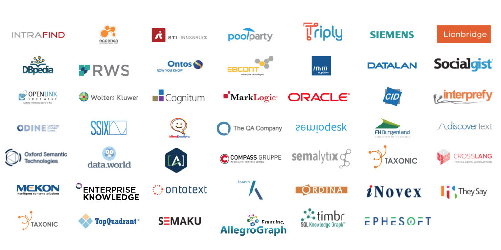

# Sponsorship Packages
***The __SEMANTiCS & LANGUAGE INTELLIGENCE 2023__ conference offers sponsors a carefully selected and high level audience with which to interact. Leading-edge technologists mixing with brand names, research luminaries, market analysts and big business users from various application markets offer a unique networking experience. In addition, carefully placed speaking slots and dedicated session naming ensures brand exposure in a targeted environment. We propose 4 main sponsoring packs that will help you meet a range of visibility and lead-generation needs. Please do not hesitate to contact us to discuss these and customise our standard offering to your specific needs.***

## Visibility and networking opportunities
Target attendance is a 400+ mix of technology providers, users & integrators, business leaders, leadingedge developers, researchers, investors and analysts who will either participate physically or remotely. Language Intelligence 2023 will comprise technology spotlights with insights into the most recent trends as well as application use cases from various domains. LI23 is the ideal meeting point to learn, exchange, network, forge new partnerships, find new clients and get tuned to the multilingual intelligent future.

  
 

Get in touch with the Sponsoring Team regarding requests, questions and booking.  
 
<a href="mailto:sponsoring@semantics.cc" style="font-size: 12pt" type="button" class="btn btn-primary">sponsoring@semantics.cc</a>

 
 

<table border="0" cellpadding="0" cellspacing="0" id="sheet0" class="sponsor-tab">
    <col class="col0">
    <col class="col1">
    <col class="col2">
    <col class="col3">
    <col class="col4">
    <col class="col5">
    <tbody>
      <tr class="row0">
        <td colspan="2" class="">YOUR PRESENCE</td>
        <td class="th-gold">Gold</td>
        <td class="th-gold">Silver</td>
        <td class="th-gold">Bronze</td>
        <td class="th-gold">StartUp</td>
      </tr>
      <tr class="row1">
        <td class="td-blue">TALKS</td>
        <td class="td-blue">Sponsored Talk 
Top level speaking opportunity in a 30 minutes slot</td>
        <td class="td-orange">✓</td>
        <td class="td-gray">&nbsp;</td>
        <td class="td-gray">&nbsp;</td>
        <td class="td-gray">&nbsp;</td>
      </tr>
      <tr class="row2">
        <td class="td-blue">&nbsp;</td>
        <td class="td-blue">Sponsored Talk 
Speaking opportunity in a 15 minutes slot</td>
        <td class="td-gray">&nbsp;</td>
        <td class="td-orange">✓</td>
        <td class="td-gray">&nbsp;</td>
        <td class="td-orange">✓</td>
      </tr>
      <tr class="row3">
        <td class="td-blue">MARKET 
PLACE</td>
        <td class="td-blue">Booth at SEMANTiCS onsite marketplace 
2x3m, table, 2 chairs, power supply, WLAN</td>
        <td class="td-orange">✓</td>
        <td class="td-orange">✓</td>
        <td class="td-gray">&nbsp;</td>
        <td class="td-gray">&nbsp;</td>
      </tr>
      <tr class="row4">
        <td class="td-blue">TICKETS</td>
        <td class="td-blue">Free conference ticket</td>
        <td class="td-orange">4</td>
        <td class="td-orange">2</td>
        <td class="td-orange">1</td>
        <td class="td-orange">2</td>
      </tr>
      <tr class="row5">
        <td class="td-blue">&nbsp;</td>
        <td class="td-blue">Discounted tickets 
tickets with 40% discount</td>
        <td class="td-orange">5</td>
        <td class="td-orange">2</td>
        <td class="td-gray">&nbsp;</td>
        <td class="td-orange">1</td>
      </tr>
      <tr class="row6">
        <td colspan="2" class="">YOUR BRAND</td>
        <td class="th-gold">&nbsp;</td>
        <td class="th-gold">&nbsp;</td>
        <td class="th-gold">&nbsp;</td>
        <td class="th-gold">&nbsp;</td>
      </tr>
      <tr class="row7">
        <td class="td-blue">MATERIAL IN THE BAG</td>
        <td class="td-blue">Placement of own material (1 A4 page max) in the onsite conference bag, plus PDF in the online conference bag</td>
        <td class="td-orange">in the conference bag</td>
        <td class="td-orange">in the conference bag</td>
        <td class="td-orange">at the infodesk</td>
        <td class="td-orange">at the infodesk</td>
      </tr>
      <tr class="row8">
        <td class="td-blue">YOUR 
LOGO</td>
        <td class="td-blue">on the SEMANTiCS website and projected during opening speech and breaks (online and onsite)</td>
        <td class="td-orange">✓</td>
        <td class="td-orange">✓</td>
        <td class="td-orange">✓</td>
        <td class="td-orange">✓</td>
      </tr>
      <tr class="row9">
        <td class="td-blue">ROLLING 
SLIDES</td>
        <td class="td-blue">Slides on screens in conference area and the virtual conference lobby</td>
        <td class="td-orange">4 slides</td>
        <td class="td-orange">3 slides</td>
        <td class="td-orange">2 slides</td>
        <td class="td-gray">&nbsp;</td>
      </tr>
      <tr class="row10">
        <td colspan="2" class="">MEDIA COVERAGE</td>
        <td class="th-gold">&nbsp;</td>
        <td class="th-gold">&nbsp;</td>
        <td class="th-gold">&nbsp;</td>
        <td class="th-gold">&nbsp;</td>
      </tr>
      <tr class="row11">
        <td class="td-blue">SOCIAL 
MEDIA</td>
        <td class="td-blue">Tweets (about you as a sponsor) advertising your webpage by SEMANTiCS 2023 between March 2023 and the conference days</td>
        <td class="td-orange">2</td>
        <td class="td-orange">2</td>
        <td class="td-orange">2</td>
        <td class="td-orange">1</td>
      </tr>
      <tr class="row12">
        <td class="td-blue">&nbsp;</td>
        <td class="td-blue">Mentioning of the sponsors in social media activities undertaken by the Conference</td>
        <td class="td-orange">all social media activities</td>
        <td class="td-orange">all social media activities</td>
        <td class="td-orange">selected social media activities</td>
        <td class="td-gray">&nbsp;</td>
      </tr>
      <tr class="row13">
        <td class="td-blue">PRESS &amp; PROMOTION</td>
        <td class="td-blue">Listing in all press releases and online dissemination</td>
        <td class="td-orange">✓</td>
        <td class="td-orange">✓</td>
        <td class="td-gray">&nbsp;</td>
        <td class="td-gray">&nbsp;</td>
      </tr>
      <tr class="row14">
        <td colspan="2" class="">LEADS GENERATION</td>
        <td class="th-gold">&nbsp;</td>
        <td class="th-gold">&nbsp;</td>
        <td class="th-gold">&nbsp;</td>
        <td class="th-gold">&nbsp;</td>
      </tr>
      <tr class="row15">
        <td class="td-blue">COMMUNITY SENDOUT</td>
        <td class="td-blue">Reaching 2000+ new leads with the sendout of a mailing of yours to the entire SEMANTiCS community</td>
        <td class="td-orange">✓</td>
        <td class="td-orange">✓</td>
        <td class="td-gray">&nbsp;</td>
        <td class="td-gray">&nbsp;</td>
      </tr>
      <tr class="row16">
        <td class="td-blue">CONFERENCE SENDOUT</td>
        <td class="td-blue">Reaching 250+ new leads with the sendout of a mailing of yours to the audience of this year's SEMANTiCS</td>
        <td class="td-orange">✓</td>
        <td class="td-orange">✓</td>
        <td class="td-orange">✓</td>
        <td class="td-orange">✓</td>
      </tr>
      <tr class="row17">
        <td colspan="2" class="th-gold">Your investment</td>
        <td class="th-gold">9800 €</td>
        <td class="th-gold">6500 €</td>
        <td class="th-gold">4300 €</td>
        <td class="th-gold">2530 €</td>
      </tr>
      <tr class="row18">
        <td colspan="2" class="th-gold">Early booking bonus (-10%) until May 31, 2023</td>
        <td class="th-gold">8820 €</td>
        <td class="th-gold">5850 €</td>
        <td class="th-gold">3870 €</td>
        <td class="th-gold">2277 €</td>
      </tr>
    </tbody>
</table>

 
 

### GET IN TOUCH WITH THE SPONSORING TEAM REGARDING REQUESTS, QUESTIONS AND BOOKING:
<a href="mailto:sponsoring@semantics.cc" style="font-size: 1.4em" type="button" class="btn btn-primary">sponsoring@semantics.cc</a>

