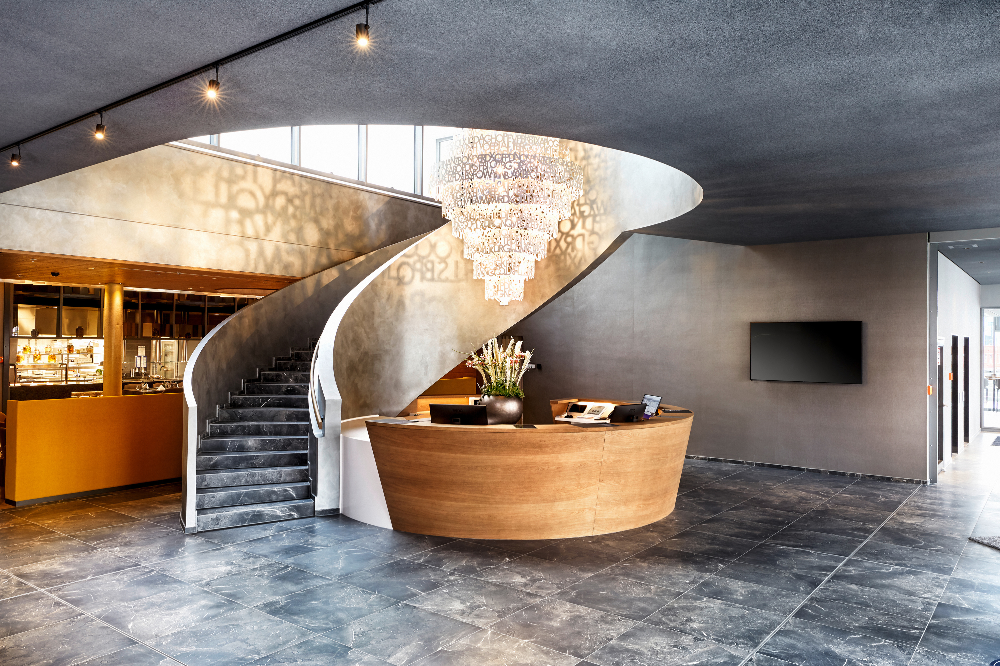

# Venue

 
   
   

 

The SEMANTiCS conference will take place at the HYPERION Hotel Leipzig. Since February 2020, the HYPERION Hotel Leipzig invites you to a pleasant stay in the historical city. The hotel is located close to the city center directly at the main station and the Augustusplatz as well as the Mädler-Passage can be reached on foot in a good 10 to 15 minutes.  

For the conference, 8 different rooms with state-of-the-art conference technology are available at the HYPERION Hotel Leipzig. On the 1st floor of the hotel there is space for the poster exhibition, sponsors and the check-in area.

 Recommended Hotels

<table>
  <tr>
    <th>Hotel</th>
    <th>Address</th>
    <!--<th>Get a reduced rate until</th>-->
  </tr>

  <tr>
    <td><a href="https://www.h-hotels.com/en/hyperion/hotels/hyperion-hotel-leipzig">HYPERION Hotel Leipzig</a></td>
    <td>Sachsenseite 7 04103 Leipzig  phone: +49 (0)341 550020 <a href="mailto:hyperion.leipzig@h-hotels.com">hyperion.leipzig@h-hotels.com</a></td>
    <!--<td>10.09.2023 Please write an email to <a href="mailto:semantics@infai.org">semantics@infai.org</a></td>-->
  </tr>

  <tr>
    <td><a href="https://www.h-hotels.com/en/h2/hotels/h2-hotel-leipzig/location">H2 Hotel Leipzig</a></td>
    <td>Sachsenseite 5 04103 Leipzig  +49 (0)341 442400 <a href="mailto:H2.Leipzig@h-hotels.com">H2.Leipzig@h-hotels.com</td>
    <!--<td>10.09.2023 Please write an email to <a href="mailto:semantics@infai.org ">semantics@infai.org</a></td>-->
  </tr>

  <tr>
    <td><a href="https://www.motel-one.com/de/hotels/leipzig/hotel-leipzig-augustusplatz/">Motel One Leipzig-Augustusplatz</a></td>
    <td>Ritterstrasse 4 04109 Leipzig  phone: +49 (0)341 2527980 <a href="mailto:leipzig-augustusplatz@motel-one.com">leipzig-augustusplatz@motel-one.com</a></td>
    <!--<td>Reservations can be made only by phone, mentioning the booking number 543.226.953. 79,00 € per night</td>-->
  </tr>

  <tr>
    <td><a href="https://www.motel-one.com/de/hotels/leipzig/hotel-leipzig-post/">Motel One Leipzig-Post</a></td>
    <td>Grimmaischer Steinweg 1 04103 Leipzig  phone: +49 (0)341 9621050 <a href="mailto:leipzig-post@motel-one.com">leipzig-post@motel-one.com</a></td>
    <!--<td>Reservations can be made only by phone, mentioning the booking number 554.122.645. 79,00 € per night</td>-->
  </tr>

  <tr>
    <td><a href="https://www.hotel-travel24.com/">Travel24 Hotel</a></td>
    <td>Tröndlinring 9 04105 Leipzig  phone: +49 (0) 341 3317 3850 <a href="mailto:reservierung@hotel-travel24.com">reservierung@hotel-travel24.com</a></td>
    <!--<td>06.09.2023 <a href="../content/booking-form_Semantics_Travel24.pdf">booking form</a></td>-->
  </tr>

  <tr>
    <td><a href="http://www.royal-leipzig.de/">Royal International</a></td>
    <td>Richard-Wagner-Straße 10 04109 Leipzig  phone: +49 (0) 3412310060 <a href="mailto:kontakt@royal-leipzig.de">kontakt@royal-leipzig.de</a></td>
    <!--<td>28.07.2023 until 6 pm booking number: 202211904 139,00 € per night</td>-->
  </tr>

  <tr>
    <td><a href="https://www.leipziger-hof.de/">Galerie Hotel Leipziger Hof</a></td>
    <td>Hedwigstraße 1-3 04315 Leipzig  phone: +49 (0) 341/6974-0 <a href="mailto:info@leipziger-hof.de">info@leipziger-hof.de</a></td>
    <!--<td>09.08.2023 “Semantics2023” 67,00 € - 90,00 € per night</td>-->
  </tr>

  <tr>
    <td><a href="https://www.premierinn.com/gb/en/home.html">Leipzig City Hahnekamm Hotel</a></td>
    <td>Brandenburger Strasse 2B 04103 Leipzig  phone: +49 (0) 341 33979939</td>
    <!--<td></td>-->
  </tr>

  <tr>
    <td><a href="https://www.hotel-bb.com/de/hotel/leipzig-city">B&B Hotel Leipzig-City</a></td>
    <td>Nikolaistraße 34 04109 Leipzig  phone:+49 (0) 341 215800 <a href="mailto:leipzig-city@hotelbb.com">leipzig-city@hotelbb.com</a></td>
    <!--<td></td>-->
  </tr>
</table>
 
We have secured contingents in a few hotels in Leipzig. After you have purchased your Semantics ticket, you will automatically receive an email from the registration system ConfTool containing this list.

### Low-price accommodation

<table>
  <tr>
    <th>Hotel</th>
    <th>Address</th>
  </tr>
  <tr>
    <td><a href="https://www.aohostels.com/de/leipzig/">A&O City Hauptbahnhof</a></td>
    <td>Brandenburger Strasse 2 04103 Leipzig  phone: +49 (0) 30 809475000</td>
  </tr>
  <tr>
    <td><a href="https://5elementshostel.de/leipzig/">Five Elements Hostel Leipzig</a></td>
    <td>Kleine Fleischergasse 8 04109 Leipzig  phone: +49 (0) 341 35583196 <a href="mailto:leipzig@5elementshostel.de">leipzig@5elementshostel.de</a></td>
  </tr>
  <tr>
    <td><a href="https://all.accor.com/lien_externe.svlt?goto=fiche_hotel&code_hotel=8000&merchantid=seo-maps-DE-8000&sourceid=aw-cen&utm_medium=seo+maps&utm_source=google+Maps&utm_campaign=seo+maps&y_source=1_MTUzNjMwMDQtNzE1LWxvY2F0aW9uLndlYnNpdGU%3D">Ibis Budget</a></td>
    <td>Reichsstraße 19 04109 Leipzig  phone: +49 (0) 341 14939420 <a href="mailto:H8000@accor.com">H8000@accor.com</a></td>
  </tr>
</table>  

## Travel
***Originally founded at the crossing of Via Regia and Via Imperii, Leipzig has been a major interchange of inter-European traffic and commerce since medieval times. After the Reunification of Germany, immense efforts to restore and expand the traffic network have been undertaken and left the city area with an excellent infrastructure.***

 Fly in by plane
  

The [Leipzig / Halle Airport](https://www.mdf-ag.com/) is about 30 minutes away (by car) from the city center of Leipzig. InterCity and regional trains leave regularly from the airport to the central station. Find other means of transportation that connect the Leipzig / Halle Airport and the city center [here](https://www.mdf-ag.com/en/passengers-and-visitors/leipzig-halle-airport/arriving-and-departing/). Berlin Airport is about 1.5 hours away, Airport Frankfurt or Airport Hannover are about 3.5 hours away by train.

 Go by train
  

The city of Leipzig is easily accessible by train from almost all European cities. Visit [Deutsche Bahn](https://www.deutschebahn.com/en) for your travel plans via train. The Leipzig central station is located right in the city center and within walking distance of the event location.

 Go by car

Thanks to its position next to the A9 (Berlin-Nürnberg), A14 (Magdeburg-Dresden) or A38 (Goettingen-Leipzig) motorways, Leipzig is ideally connected to the national motorway network. The city center can be reached via the following exits.

### A9, Exit Leipzig West
* follow Leipzig West / B181 and Merseburger Straße/181
* continue on Merseburger Straße / B87 (signs direction Torgau / Zentrum)
* turn left onto the Lützner Straße / B87 (signs direction Torgau / Zentrum)
* continue on Bowmanstraße / B87 (signs direction Zentrum)
* turn right onto the Jahnallee / B87 (signs direction Zentrum)
* follow the main road until Willy-Brandt-Platz / main station
* take a left turn and stay on Brandenburger Straße
* at the next traffic light take a left turn onto Sachsenseite

### A14 Exit Leipzig Mitte
* take exit 23-Leipzig-Mitte to merge onto Maximilianallee/ B2 toward Leipzig-Mitte
* use the middle lane to turn slightly left onto Am Gothischen Bad/Rackwitzer Str./B2/B6
* use the right lane to turn right onto Brandenburger Str./B2/B87
* stay on Brandenburger Straße
* take a right turn onto Sachsenseite

### A38 Exit Leipzig Süd
* take B2 to Wundtstraße in Leipzig (watch out for signs: A9 / Weißenfels / Grünau / Zentrum)
* keep left to continue on Wundtstraße
* stay on main road until Floss Platz
* stay on main road until Harkortstraße
* turn right onto Martin-Luther-Ring
* stay on main road until Augustusplatz
* stay on main road until Georgiring
* continue onto Willy-Brandt-Platz/B87
* at the next traffic light take a left turn onto Sachsenseite

## Parking spaces in Leipzig
***The underground car park “Parkhaus Fernbus-Terminal Hbf” is the closest one to the event location.*** Check all [car parks](https://www.leipzig.de/umwelt-und-verkehr/unterwegs-in-leipzig/auto-motorrad-und-reisemobile/parkhaeuser-innenstadt/) in Leipzig (German only).
