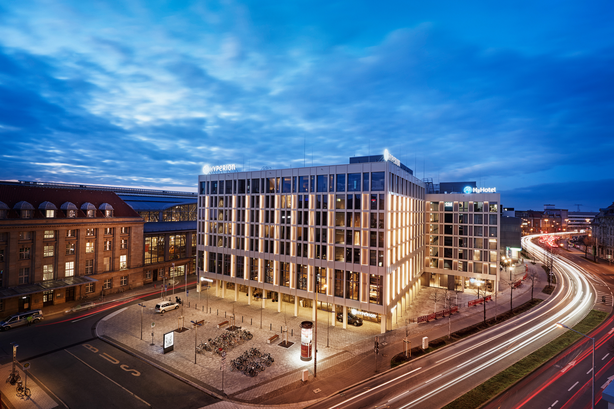

# Venue

   

The SEMANTiCS conference will take place at the HYPERION Hotel Leipzig. Since February 2020, the HYPERION Hotel Leipzig invites you to a pleasant stay in the historical city. The hotel is located close to the city center directly at the main station and the Augustusplatz as well as the Mädler-Passage can be reached on foot in a good 10 to 15 minutes.  

For the conference, 8 different rooms with state-of-the-art conference technology are available at the HYPERION Hotel Leipzig. On the 1st floor of the hotel there is space for the poster exhibition, sponsors and the check-in area. 

## Recommended Hotels

| Hotel | Address |
|---|---|
| HYPERION Hotel Leipzig | Sachsenseite 7 04103 Leipzig phone: +49 (0)341 550020 hyperion.leipzig@h-hotels.com  |
| H2 Hotel Leipzig  | Sachsenseite 5 04103 Leipzig +49 (0)341 442400  H2.Leipzig@h-hotels.com  |
| Motel One Leipzig-Augustusplatz  | Ritterstrasse 4 04109 Leipzig phone: +49 (0)341 2527980 leipzig-augustusplatz@motel-one.com  |
| Motel One Leipzig-Post | Grimmaischer Steinweg 1 04103 Leipzig phone: +49 (0)34) 9621050 leipzig-post@motel-one.com  |
| Leipzig City Hahnekamm Hotel  | Brandenburger Strasse 2B 04103 Leipzig  phone: +49 (0) 341 33979939  |
| B&B Hotel Leipzig-City  | Nikolaistraße 34 04109 Leipzig phone:+49 (0) 341 215800 leipzig-city@hotelbb.com  |

### Low-price accommodation

| Hotel | Address |
|---|---|
| A&O City Hauptbahnhof  | Brandenburger Strasse 2 04103 Leipzig phone: +49 (0) 30 809475000  |
| Five Elements Hostel Leipzig  | Kleine Fleischergasse 8 04109 Leipzig phone: +49 (0) 341 35583196 leipzig@5elementshostel.de  |

## Travel and Lodging
***Originally founded at the crossing of Via Regia and Via Imperii, Leipzig has been a major interchange of inter-European traffic and commerce since medieval times. After the Reunification of Germany, immense efforts to restore and expand the traffic network have been undertaken and left the city area with an excellent infrastructure.***

### Fly in by plane
The [Flughafen Leipzig / Halle](http://www.leipzig-halle-airport.de/de/index.html) is about 30 minutes away (by car) from the city centre of Leipzig. InterCity and regional trains run regularly between the airport and central station. Berlin Airport is about 1.5 hours away, Airport Frankfurt or Airport Hannover are about 3.5 hours away by train.

### Go by train
The city of Leipzig is well accessible by train [Deutschen Bahn](https://www.deutschebahn.com/en) from almost all European cities. The central station is very close to the city center and to the event location.

### Go by car
Motorway exit Leipzig via Autobahn A9 (Berlin-Nürnberg), A14 (Magdeburg-Dresden) or A38 (Goettingen-Leipzig) 

**A9, Exit Leipzig West** 
* follow Leipzig West / B181 and Merseburger Straße/181
* continue on Merseburger Straße / B87 (signs direction Torgau / Zentrum)
* turn left into the Lützner Straße / B87 (signs direction Torgau / Zentrum)
* continue on Bowmanstraße / B87 (signs direction Torgau / Zentrum)
* turn right into the Jahnallee / B87 (signs direction Torgau / Zentrum)
* follow the main road until Willy-Brandt-Platz / main station
* take a left turn and stay on Brandenburger Straße 
* at the next traffic light take a left turn into Sachsenseite 
* You could use the underground car park called “Parkhaus Fernbus-Terminal Hbf.

**A14 Exit Leipzig Mitte**
* B2 / Maximilianallee
* keep right at Berliner Straße (watch out for Signs: Zentrum)
* stay on Berliner Straße
* take a left turn at Gerberstraße / B6
* take a left turn at Willy-Brandt-Platz / B6 / B87
* at Georgiring, take a right turn (watch out for signs: A38 / Grimma)
* stay on main road until Augustusplatz
* Follow the city's inner ring road until Augustusplatz / Goethestraße. You could use the underground car park at Augustusplatz.

**A38 Exit Leipzig Süd** 
* stay on B2 until Wundtstraße (watch out for signs: A9 / Weißenfels / Grünau / Zentrum)
* stay on main road until Floss Platz
* stay on main road until Harkortstraße
* take a right turn at Martin-Luther-Ring
* stay on main road until Augustusplatz
* Follow the city's inner ring road until Augustusplatz. You could use the underground car park at Augustusplatz.

**→Please check all [car parks](https://www.leipzig.de/umwelt-und-verkehr/unterwegs-in-leipzig/auto-motorrad-und-reisemobile/parkhaeuser-innenstadt/) in Leipzig (German only).** 

