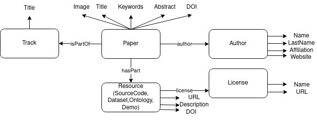

## Semantics 2023 mappings

This folder contains the documentation for generating the KG for Semantics 2023 conference and the corresponding web pages with the program.

**Author:** Daniel Garijo, Ontology Engineering Group, Universidad Politécnica de Madrid.

**License:** This work has a [CC-BY 4.0 International license](https://creativecommons.org/licenses/by/4.0/legalcode).

### File organization

- The `doc` folder contains figures used for the modeling.
- The `data` folder contains the csvs extracted from easychair and manually curated to capture the contents of the papers
- The `mappings` folder contains the RML mappings that are needed to create the KG
- The `web_scripts` contains the scripts needed to load the KG and create the websites.
- The `graph_statistics` folder contains the scripts for generating general statistics of the graph (number of papers, etc.)
- The `rdf` file contains the RDF triples for the KG
- The `configuration.ini` contains the configuration for the KG generation.

### Pre-requisites (KG generation)
Install [morph-kgc](https://github.com/morph-kgc/morph-kgc)

### Generate the KG
The `configuration.ini` contains the paths to the mappings and datasets to process. Once you have set them up, simply run morph-kgc with the following command:

`python3 -m morph_kgc configuration.ini`

Right now, the output is written into an `out.ttl` file.

You may need to change the types of schema:Ontology to owl:Ontology manually.

### Data modeling

The current example depicts a simple representation for authors, papers and resources from three different CSVs (with paper information, author information and resource information, respectively). The main property and class diagram relating all three is depicted below:

Classes are represented in rounded rectangles, while the properties linking them are represented with arrows. Datatype properties are arrows with no label.

All classes, properties and data properties are modeled using [Schema.org](https://schema.org/), except for `Ontology`, which uses `owl:Ontology`.

#### Class representation

The following classes are reused: 
- schema:Event for representing a conference track
- schema:ScholarlyPublication for representing a paper.
- schema:Person for representing an author.
- schema:Dataset, schema:SoftwareSourceCode, schema:SoftwareApplication, schema:Dataset, and owl:Ontology for representing different types of resources: Code, Demos, Dataset and Ontologies.
- schema:CreativeWork to represent licenses.

#### Property representation
The following properties are reused:
- schema:name for representing titles or person names.
- schema:isPartOf to represent the relationship between a paper and the track it belongs.
- schema:image to represent the image associated with a paper.
- schema:keywords to represent the keywords of a paper.
- schema:abstract to represent the abstract of a paper.
- schema:identifier to associate a paper/resource with its DOI
- schema:hasPart to associate a paper with the resources it describes.
- schema:author to represent the authors of a paper.
- schema:givenName for representing people's first names.
- schema:lastName for representing people's last names.
- schema:affiliation for representing the institution of a person.
- schema:url to indicate the website of a resource, person or license.
- schema:description to provide a brief description of a resource.

An extra property called "authorString" property has been defined to retain the authors in order, in order to avoid representing their position in the paper.